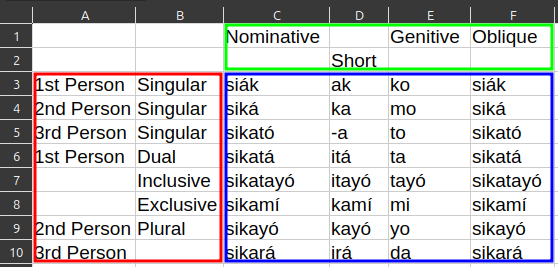

# funcsv2db
A CSV processor to insert to database for use in Funcwords project.

Just run `sample.py` for example output and read the code for usage. The output to stdout is just a "do" block with (unsafe) insert queries inside.

## Use Case

Since this is used for a specific project, the way CSVs are processed is specific, too. Consider the following CSV of a grammar table:

Let's call the cells inside the blue, red, and green boxes *entries*, *headers in column* (`h_in_c` in code), and *headers in row* (`h_in_r` in code), respectively. This program can be used iff the headers correspond to already inserted records from other tables, thus aside from the insertions of entries in a specific table (let's call it the *main* table), there will also be insertions to junction tables connecting the other tables and the main. On the other hand, depending on the configuration JSON file, not *all* headers may directly correspond to insertions to junction tables. In the above table, the second row does not directly correspond to insertions, but is concatenated to the first row, which does.

## Assumptions
- The primary key fields for all tables have the same name (`id` by default). It is possible to override this in your custom `main_query` and `junc_query` functions.
- The evaluated string for header values will not have trailing spaces nor multiple consecutive spaces between non-space characters.
- The *ditto* in the configuration JSON file means that if true, then empty cells in headers will have the same value as the previous non-empty cell.
- By default, *Same Value in Same Row is Same Data* (SVSRSD). For example, the "siák" entry below "Nominative" and the one below "Possessive" will be one inserted data to main table. This can be disabled in the `convert` function.