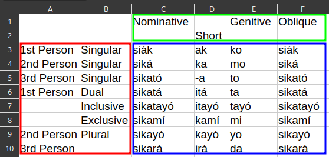

# csv2db
A CSV processor to insert to database for use in Funcwords project.

Just run `sample_csv.py` in `sample/csv2db` directory for example output and read the code for usage. The output to stdout is just a "do" block with (unsafe) insert queries inside.

## Use Case

Since this is used for a specific project, the way CSVs are processed is specific, too. Consider the following CSV of a grammar table:

Let's call the cells inside the blue, red, and green boxes *entries*, *headers in column* (`h_in_c` in code), and *headers in row* (`h_in_r` in code), respectively. This program can be used iff the headers correspond to already inserted records from other tables, thus aside from the insertions of entries in a specific table (let's call it the *main* table), there will also be insertions to junction tables connecting the other tables and the main. On the other hand, depending on the configuration JSON file, not *all* headers may directly correspond to insertions to junction tables. In the above table, the second row does not directly correspond to insertions, but is concatenated to the first row, which does.

## Required Object Keys in the Configuration JSON
- `main`: data for insertion of entry to the main table
    - `table`: main table name.
    - `other_values`: an array of string values to be evaluated for fields in the main table that are *not* the field for entry.
    - `where`: an array of field-value pairs for conditions/WHERE clause. The second element in pair, the value, will be evaluated.
- `junc_fields`: data for fields to be populated in insertion to junction tables.
- `junc_wheres`: an array of objects for specifying an insertion to junction tables.
    - `row_col`: "r" for row, "c" for column, or "" for none.
    - `nth`: nth row or column to consider (0-based).
    - `ditto`: see Assumptions section below for info.
    - `value`: header value to be evaluated.
- `header_rows`: number of rows (starting from first) to be considered as header.
- `header_cols`: number of columns (starting from first) to be considered as header.

## String Evaluation
The mention of "evaluation" in the above section is because of the string interpolation feature: the variable inside curly brackets (e.g., `"{pkey}"`) evaluates to the value in the `in_vars` lookup object. Additionally, for `value`s inside an entry in `junc_wheres` where `row_col` = "r" or "c", the number inside curly brackets (e.g., `"{1} {0} Case"`) evaluates to header values; n > 0 means getting the value of the cell n rows/columns away from the original `nth`. The empty `{}` is same as `{0}`.

## Assumptions
- The primary key fields for all tables have the same name (`id` by default). It is possible to override this in your custom callbacks `main_cb` and `junc_cb`.
- The evaluated string for header values will have leading and trailing spaces *removed*, and have multiple consecutive spaces between non-space characters *reduced to a single space*.
- The *ditto* in the configuration JSON file means that if true, then empty cells in headers will have the same value as the previous non-empty cell.
- By default, *Same Value in Same Row is Same Data* (SVSRSD). For example, the "siák" entry below "Nominative" and the one below "Oblique" will be one inserted data to main table. This can be disabled in the `convert` function.
- Empty or just spaces cell of entry or header to be inserted means no execution of custom callbacks.