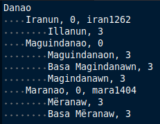

# tree2db
An indent tree text processor to insert to database for use in Funcwords project.

Just run `sample_tree.py` in `sample/tree2db` directory for example output and read the code for usage. The output to stdout is just a series of (unsafe) insert queries.

## Use Case
Since we are constructing a language family tree, it would be nice to automate insert queries. Here is the sample text file provided in this repo:

The entry not indented ("Danao") must be inserted already in the database. The indented lines will be inserted; the indentation determines the parent-child relationship between the lines. Each indented line will be split with respect to comma (",") and the resulting array of substrings (let's call it *line list*) must be handled by your custom callback `query_cb`. For our `query_cb` that will process the text file in the above screenshot, the first substring is the entry, followed by the integer "mode", followed by an optional Glottolog value.

## Assumptions
- All elements of the line list will have leading and trailing spaces *removed*.
- The `indent` parameter determines the tree depth of a line. If this is zero, then depth is based on number of *tabs* at the beginning of line. Else, it is the number of *spaces* that must constitute as 1 depth. Computation of depth uses *ceiling division* to handle inexact indents. For example, if `indent` is 4, a 0 space indent corresponds to 0 depth, but 1, 2, 3, and 4 spaces indent all correspond to 1 depth.